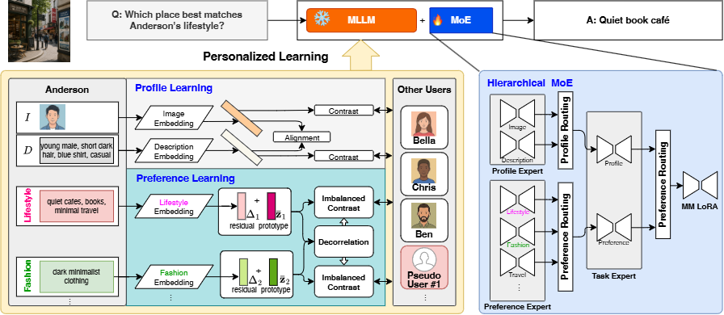

# PrefMLLM



PrefMLLM is a preference-centric personalized MLLM framework for mitigating
group preference collapse in multi-user personalized VQA.  It separates stable
profile cues from multi-faceted preference cues, decomposes each preference
facet into a shared prototype plus a personalized residual, and uses a
factorized user-aware hierarchical MoE router to activate profile, preference,
and task-specific adaptation paths.

## Directory Layout

- `llava/model/prefmllm/`: paper-facing aliases for the core method modules.
- `llava/model/memory/`: factorized user-state memory, preference residuals,
  pseudo-user counterfactual bank, and hierarchical MoE adapters.
- `PrefMoE/`: PrefMLLM's publication-facing MoE/LoRA adapter package.
- `llava/train/train_prefmoe.py`: main training entry; use `--train_mode prefmllm`.
- `llava/eval/prefmoe/eval_demo/eval_prefmoe_bridge_2.py`: 0-turn and 10-turn eval.
- `llava/eval/prefmllm/collapse_metrics.py`: FPout preference-collapse metric.
- `configs/prefmllm_default.json`: default paper-aligned configuration.
- `data/mmpb_clean/`: 200-row incomplete MMPB clean subset, split file,
  counterfactual user file, and paired query/profile images.
- `data/multi_turn/`: generic 10-turn transcript examples.
- `scripts/train/`, `scripts/eval/`, `scripts/smoke/`: runnable entry scripts.

## Method Terms

| Paper term | Code |
| --- | --- |
| Factorized user state | `FactorizedUserStateMemory` |
| Profile factors | `image_token`, `description_token` |
| Preference facets | `entertainment`, `travel`, `lifestyle`, `shopping`, `fashion` |
| Shared prototype | `shared_pref_tokens` |
| Personalized residual | `offset_pref_tokens` |
| Imbalance-aware residual preservation | `loss_pref_residual_density_focal` |
| Preference decorrelation | `loss_pref_decorrelation` |
| Hierarchical MoE routing | `FactorizedUserAwareHierarchicalMoE` |
| Collapse metric | `python -m llava.eval.prefmllm.collapse_metrics` |

Internal checkpoint keys still use `name_memory_*` for compatibility, but the
release scripts and docs use the PrefMLLM paper terminology.

## Install

```bash
cd opensource_release
python3 -m venv .venv
source .venv/bin/activate
pip install -r requirements.txt
pip install -e .
```

Place external model assets under generic paths:

- `./checkpoints/vicuna-7b-v1.5`
- `./checkpoints/clip-vit-large-patch14-336`
- `./checkpoints/llava-v1.5-mlp2x-336px-pretrain-vicuna-7b-v1.5/mm_projector.bin`

## Data Format

Training/eval data is a CSV.  Required columns are:

`index,name,attribute,category,l2-category,concept,question,answer,image_path,preference,description_simple,description_moderate,description_detailed,description_super_detailed`.

For profile-image anchoring, add `injection_image_1` through
`injection_image_5` when available.  For FPout collapse reporting, add
`preference_bucket_names` as a `|`-separated true user set and optional
`preference_semantic_invert`.

The split file is JSON or PKL with:

```json
[{"tasks": [{"train_idx": [0, 1], "test_idx": [2, 3]}]}]
```

This release includes an incomplete 200-row MMPB clean subset at
`data/mmpb_clean/sample.csv` with `160` train and `40` test indices.  It covers
preference yes/no, recognition yes/no, preference MCQ, and recognition MCQ
examples across all five preference facets.  The referenced query/profile
images are bundled under `data/mmpb_clean/images/` and
`data/mmpb_clean/injection/`, and paths are relative to `IMAGE_FOLDER=./data`.

## Training

```bash
bash scripts/train/train_prefmllm.sh
```

Override paths through environment variables:

```bash
DATA_PATH=./data/mmpb_clean/sample.csv \
SPLIT_PATH=./data/mmpb_clean/split.json \
IMAGE_FOLDER=./data \
PSEUDO_USER_CSV=./data/mmpb_clean/pseudo_users.csv \
OUTPUT_DIR=./outputs/prefmllm_hmoe \
bash scripts/train/train_prefmllm.sh
```

Expected training outputs are written under `OUTPUT_DIR`, including adapter
weights and `name_memory_trainables.bin` for the PrefMLLM user-state modules.

## Evaluation

0-turn:

```bash
bash scripts/eval/eval_prefmllm_0turn.sh
```

10-turn:

```bash
bash scripts/eval/eval_prefmllm_10turn.sh
```

Expected outputs:

- predictions: `./outputs/eval_*/pairs/fold_0/mt_00_et_00/*.pkl`
- raw predictions: `./outputs/eval_*/raw/fold_0/mt_00_et_00_raw.csv`
- score table: `./outputs/eval_*/scores/fold_0/mt_00_et_00_score.csv`

Preference-collapse FPout:

```bash
INPUT_CSV=./outputs/eval_0turn/raw/fold_0/mt_00_et_00_raw.csv \
OUTPUT_DIR=./outputs/eval_0turn/fpout \
bash scripts/eval/compute_preference_collapse.sh
```


## Notes

- The release excludes checkpoints, pretrained weights, logs, run folders, and
  local absolute paths.
- Full reproduction requires downloading the base LLaVA/Vicuna/CLIP assets and
  preparing the personalized VQA dataset in the CSV format above.
- See `docs/PAPER_ALIGNMENT.md` for the implementation checklist.
