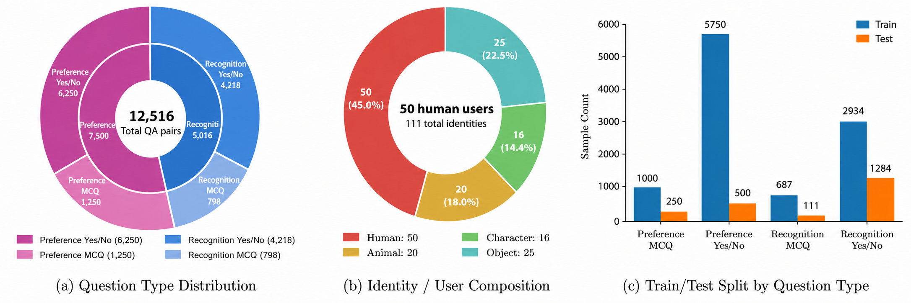
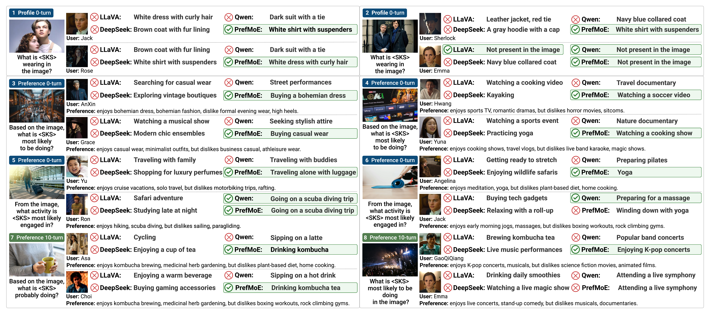

# Group Preference Collapse in Personalized Multimodal Large Language Models

<p align="center">
  <strong>Fan Lyu, Wenqi Zhang, Joost van de Weijer</strong><br>
  Computer Vision Center, Universitat Autònoma de Barcelona
</p>

<p align="center">
  <a href="#"></a>
  <a href="#"></a>
  <a href="https://wqzhang1030.github.io/prefermoe.github.io/"></a>
  <a href="#"></a>
</p>

## 🧠 Abstract

Personalized multimodal large language models (MLLMs) aim to generate
user-specific responses, but existing methods mainly rely on profile-level
information and overlook diverse user preferences. We identify group preference
collapse, where multi-user personalized MLLMs become insensitive to individual
preferences and drift toward dominant population-level choices due to suppressed
preference signals and unreliable preference use during generation. We propose
PrefMoE, a preference-centric framework that separates stable profile
information from preference-related representations. PrefMoE decomposes
preferences into shared prototypes and personalized residuals, preserves
individualized residuals with imbalance-aware learning, counterfactual
pseudo-user augmentation, and residual decorrelation, and routes profile and
preference factors through separate LoRA adaptation paths. Experiments across
multiple MLLM backbones show that PrefMoE improves preference-sensitive
personalization while substantially reducing preference collapse.

<p align="center">
  
</p>

## 🧩 Overview of PrefMoE

<p align="center">
  
</p>

Overview of PrefMoE. PrefMoE separates profile and preference representations,
models preferences with shared prototypes and personalized residuals, and
regularizes the residuals with contrastive learning and decorrelation. A
hierarchical MoE router then activates profile- and preference-aware LoRA
experts for query-dependent personalized reasoning.

## 📊 MMPB-clean Dataset Statistics

<p align="center">
  
</p>

## 📈 Main Results

| Method | Type | 0-turn Overall↑ | 0-turn Preference↑ | 0-turn Profile↑ | 0-turn Collapse↓ | 10-turn Overall↑ | 10-turn Preference↑ | 10-turn Profile↑ | 10-turn Collapse↓ |
| --- | --- | ---: | ---: | ---: | ---: | ---: | ---: | ---: | ---: |
| **Non-tuned Models** | | | | | | | | | |
| LLaVA-1.5-7B | *NT* | 0.3564 | 0.3387 | 0.3716 | 0.6228 | 0.3167 | 0.3067 | 0.3337 | 0.6164 |
| LLaVA-1.5-13B | *NT* | 0.4023 | 0.3653 | 0.4222 | 0.6027 | 0.3716 | 0.3333 | 0.3928 | 0.6119 |
| LLaVA-OV-72B | *NT* | 0.5100 | 0.4800 | 0.5262 | 0.5297 | 0.4620 | 0.4333 | 0.4774 | 0.5525 |
| DeepSeek-VL2-Tiny | *NT* | 0.3683 | 0.3613 | 0.3720 | 0.7169 | 0.3497 | 0.3440 | 0.3527 | 0.6895 |
| DeepSeek-VL2-Small | *NT* | 0.3866 | 0.3853 | 0.3871 | 0.6895 | 0.3642 | 0.3667 | 0.3669 | 0.6712 |
| DeepSeek-VL2 | *NT* | 0.4620 | 0.4533 | 0.4667 | 0.5890 | 0.4103 | 0.4067 | 0.4122 | 0.5982 |
| Qwen2.5-VL-7B | *NT* | 0.4276 | 0.3587 | 0.5653 | 0.6484 | 0.3885 | 0.3433 | 0.4315 | 0.6530 |
| Qwen2.5-VL-32B | *NT* | 0.4914 | 0.4333 | 0.5226 | 0.5708 | 0.4410 | 0.4027 | 0.4616 | 0.5982 |
| Qwen2.5-VL-72B | *NT* | 0.5301 | 0.4600 | 0.5677 | 0.5023 | 0.5016 | 0.4453 | 0.5319 | 0.5525 |
| **Fine-tuned and PEFT Baselines** | | | | | | | | | |
| LLaVA-1.5-7B | *FFT* | 0.5072 | 0.4413 | 0.5427 | 0.3425 | 0.5026 | 0.4413 | 0.5355 | 0.3470 |
| LLaVA-1.5-13B | *FFT* | 0.5301 | 0.4600 | 0.5677 | 0.3105 | 0.5100 | 0.4400 | 0.5477 | 0.3196 |
| LLaVA-OV-72B | *FFT* | 0.6200 | 0.5947 | 0.6337 | 0.3151 | 0.5613 | 0.5320 | 0.5771 | 0.3379 |
| DeepSeek-VL2-Tiny | *FFT* | 0.4711 | 0.4213 | 0.4975 | 0.5845 | 0.4681 | 0.4187 | 0.4946 | 0.5936 |
| DeepSeek-VL2-Small | *FFT* | 0.4862 | 0.3840 | 0.5412 | 0.6530 | 0.4834 | 0.3747 | 0.5419 | 0.6530 |
| DeepSeek-VL2 | *FFT* | 0.5814 | 0.5093 | 0.6201 | 0.4521 | 0.5748 | 0.4987 | 0.6158 | 0.4566 |
| Qwen2.5-VL-7B | *FFT* | 0.4452 | 0.3013 | 0.5226 | 0.6530 | 0.4807 | 0.3707 | 0.5398 | 0.7854 |
| Qwen2.5-VL-32B | *FFT* | 0.5718 | 0.5480 | 0.5849 | 0.4795 | 0.4914 | 0.4333 | 0.5226 | 0.5114 |
| Qwen2.5-VL-72B | *FFT* | 0.6014 | 0.5947 | 0.6057 | 0.4018 | 0.5217 | 0.5053 | 0.5305 | 0.3927 |
| Yo'LLaVA | *PEFT* | 0.5040 | 0.4880 | 0.5125 | 0.2075 | 0.4840 | 0.4680 | 0.4925 | 0.2146 |
| LLaVA-NeXT-34B | *PEFT* | 0.5599 | 0.6200 | 0.5276 | 0.2466 | 0.5299 | 0.5900 | 0.4976 | 0.2054 |
| LOVA3 | *PEFT* | 0.5329 | 0.5680 | 0.5140 | 0.4292 | 0.4979 | 0.5330 | 0.4790 | 0.4247 |
| TG-LLaVA | *PEFT* | 0.5413 | 0.5800 | 0.5204 | 0.2329 | 0.5013 | 0.5400 | 0.4804 | 0.1506 |
| **PrefMoE** | | | | | | | | | |
| PrefMoE (LLaVA-1.5-7B) | *PEFT* | 0.6751 | 0.6733 | 0.6760 | 0.1233 | 0.5986 | 0.5840 | 0.6065 | 0.1553 |
| PrefMoE (LLaVA-1.5-13B) | *PEFT* | 0.7012 | 0.6800 | 0.7125 | 0.1416 | 0.6601 | 0.6267 | 0.6781 | 0.1370 |
| PrefMoE (LLaVA-OV-72B) | *PEFT* | 0.7893 | 0.7613 | 0.8043 | 0.1142 | 0.6914 | 0.6627 | 0.7068 | **0.1187** |
| PrefMoE (DeepSeek-VL2-Tiny) | *PEFT* | 0.6601 | 0.6467 | 0.6674 | 0.2511 | 0.6033 | 0.5933 | 0.6086 | 0.2740 |
| PrefMoE (DeepSeek-VL2-Small) | *PEFT* | 0.7305 | 0.5813 | 0.8108 | 0.2740 | 0.6382 | 0.5200 | 0.7018 | 0.2694 |
| PrefMoE (DeepSeek-VL2) | *PEFT* | 0.7991 | 0.7520 | **0.8244** | 0.1324 | 0.7012 | **0.6800** | 0.7125 | 0.1826 |
| PrefMoE (Qwen2.5-VL-7B) | *PEFT* | 0.7613 | 0.6880 | 0.8007 | 0.1781 | 0.6503 | 0.6253 | 0.6638 | 0.1826 |
| PrefMoE (Qwen2.5-VL-32B) | *PEFT* | 0.7902 | 0.7640 | 0.8043 | 0.1416 | 0.6900 | 0.6653 | 0.7032 | 0.2100 |
| PrefMoE (Qwen2.5-VL-72B) | *PEFT* | **0.8112** | **0.7893** | 0.8237 | **0.1096** | **0.7301** | 0.5813 | **0.8100** | 0.1279 |

**Table 1.** Major comparisons with SOTAs under 0-turn and 10-turn settings.

## 🔬 Ablation Study

| E | P | I | C | D | M | 0-turn Overall↑ | 0-turn Preference↑ | 0-turn Profile↑ | 0-turn Collapse↓ | 10-turn Overall↑ | 10-turn Preference↑ | 10-turn Profile↑ | 10-turn Collapse↓ |
| --- | --- | --- | --- | --- | --- | ---: | ---: | ---: | ---: | ---: | ---: | ---: | ---: |
| ✓ | | | | | | 0.5562 | 0.4120 | 0.6337 | 0.6027 | 0.4928 | 0.3584 | 0.5651 | 0.6347 |
| ✓ | ✓ | | | | | 0.6000 | 0.5700 | 0.6159 | 0.3333 | 0.5266 | 0.4902 | 0.5461 | 0.3653 |
| ✓ | ✓ | ✓ | | | | 0.6279 | 0.6133 | 0.6358 | 0.3288 | 0.5506 | 0.5275 | 0.5631 | 0.3607 |
| ✓ | ✓ | ✓ | ✓ | | | 0.6303 | 0.6253 | 0.6330 | 0.2283 | 0.5571 | 0.5393 | 0.5667 | 0.2603 |
| ✓ | ✓ | ✓ | ✓ | ✓ | | 0.6382 | 0.6467 | 0.6337 | 0.1457 | 0.5688 | 0.5622 | 0.5723 | 0.1781 |
| ✓ | ✓ | ✓ | ✓ | ✓ | ✓ | **0.6751** | **0.6733** | **0.6760** | **0.1233** | **0.5986** | **0.5840** | **0.6065** | **0.1553** |

**Table 2.** Component-wise ablation study of the proposed method. E, P, I,
C, D, and M denote the basic user embedding module, profile factor learning,
imbalance-aware residual preservation, counterfactual user augmentation,
preference decorrelation, and hierarchical MoE router, respectively.

## 🖼️ Qualitative Examples

<p align="center">
  
</p>

**Figure 3.** Qualitative examples. `<SKS>` denotes the target personalized
identity or concept. Green boxes indicate correct predictions, while red marks
indicate incorrect predictions.

## 📁 Directory Layout

- `llava/model/prefmllm/`: paper-facing aliases for the core method modules.
- `llava/model/memory/`: factorized user-state memory, preference residuals,
  pseudo-user counterfactual bank, and hierarchical MoE adapters.
- `PrefMoE/`: PrefMLLM's publication-facing MoE/LoRA adapter package.
- `llava/train/train_prefmoe.py`: main training entry; use `--train_mode prefmllm`.
- `llava/eval/prefmoe/eval_demo/eval_prefmoe_bridge_2.py`: 0-turn and 10-turn eval.
- `llava/eval/prefmllm/collapse_metrics.py`: FPout preference-collapse metric.
- `configs/prefmllm_default.json`: default paper-aligned configuration.
- `data/mmpb_clean/`: 200-row incomplete MMPB clean subset, split file,
  counterfactual user file, and paired query/profile images.
- `data/multi_turn/`: generic 10-turn transcript examples.
- `scripts/train/`, `scripts/eval/`, `scripts/smoke/`: runnable entry scripts.

## 🛠️ Method Terms

| Paper term | Code |
| --- | --- |
| Factorized user state | `FactorizedUserStateMemory` |
| Profile factors | `image_token`, `description_token` |
| Preference facets | `entertainment`, `travel`, `lifestyle`, `shopping`, `fashion` |
| Shared prototype | `shared_pref_tokens` |
| Personalized residual | `offset_pref_tokens` |
| Imbalance-aware residual preservation | `loss_pref_residual_density_focal` |
| Preference decorrelation | `loss_pref_decorrelation` |
| Hierarchical MoE routing | `FactorizedUserAwareHierarchicalMoE` |
| Collapse metric | `python -m llava.eval.prefmllm.collapse_metrics` |

Internal checkpoint keys still use `name_memory_*` for compatibility, but the
release scripts and docs use the PrefMLLM paper terminology.

## 🚀 Install

```bash
cd opensource_release
python3 -m venv .venv
source .venv/bin/activate
pip install -r requirements.txt
pip install -e .
```

Place external model assets under generic paths:

- `./checkpoints/vicuna-7b-v1.5`
- `./checkpoints/clip-vit-large-patch14-336`
- `./checkpoints/llava-v1.5-mlp2x-336px-pretrain-vicuna-7b-v1.5/mm_projector.bin`

## 📦 Data Format

Training/eval data is a CSV.  Required columns are:

`index,name,attribute,category,l2-category,concept,question,answer,image_path,preference,description_simple,description_moderate,description_detailed,description_super_detailed`.

For profile-image anchoring, add `injection_image_1` through
`injection_image_5` when available.  For FPout collapse reporting, add
`preference_bucket_names` as a `|`-separated true user set and optional
`preference_semantic_invert`.

The split file is JSON or PKL with:

```json
[{"tasks": [{"train_idx": [0, 1], "test_idx": [2, 3]}]}]
```

This release includes an incomplete 200-row MMPB clean subset at
`data/mmpb_clean/sample.csv` with `160` train and `40` test indices.  It covers
preference yes/no, recognition yes/no, preference MCQ, and recognition MCQ
examples across all five preference facets.  The referenced query/profile
images are bundled under `data/mmpb_clean/images/` and
`data/mmpb_clean/injection/`, and paths are relative to `IMAGE_FOLDER=./data`.

## 🏋️ Training

```bash
bash scripts/train/train_prefmllm.sh
```

Override paths through environment variables:

```bash
DATA_PATH=./data/mmpb_clean/sample.csv \
SPLIT_PATH=./data/mmpb_clean/split.json \
IMAGE_FOLDER=./data \
PSEUDO_USER_CSV=./data/mmpb_clean/pseudo_users.csv \
OUTPUT_DIR=./outputs/prefmllm_hmoe \
bash scripts/train/train_prefmllm.sh
```

Expected training outputs are written under `OUTPUT_DIR`, including adapter
weights and `name_memory_trainables.bin` for the PrefMLLM user-state modules.

## ✅ Evaluation

0-turn:

```bash
bash scripts/eval/eval_prefmllm_0turn.sh
```

10-turn:

```bash
bash scripts/eval/eval_prefmllm_10turn.sh
```

Expected outputs:

- predictions: `./outputs/eval_*/pairs/fold_0/mt_00_et_00/*.pkl`
- raw predictions: `./outputs/eval_*/raw/fold_0/mt_00_et_00_raw.csv`
- score table: `./outputs/eval_*/scores/fold_0/mt_00_et_00_score.csv`

Preference-collapse FPout:

```bash
INPUT_CSV=./outputs/eval_0turn/raw/fold_0/mt_00_et_00_raw.csv \
OUTPUT_DIR=./outputs/eval_0turn/fpout \
bash scripts/eval/compute_preference_collapse.sh
```


## 🧾 License

This project is licensed under the MIT License.
